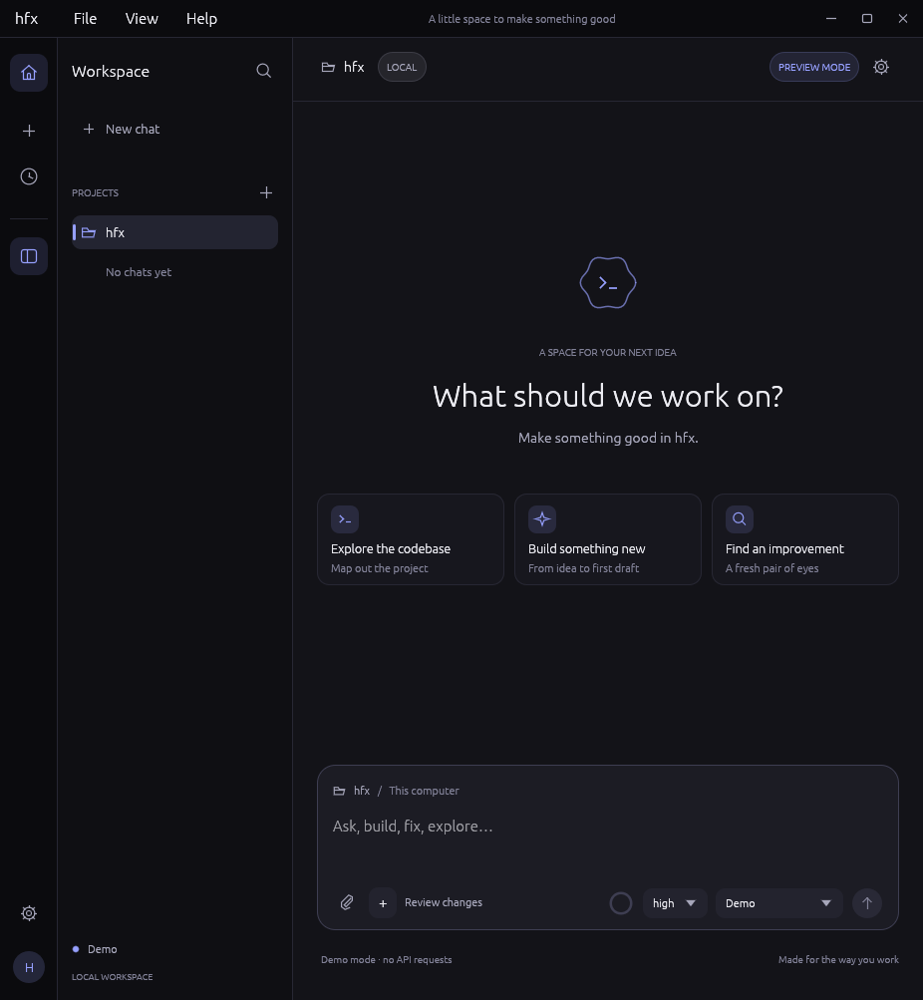
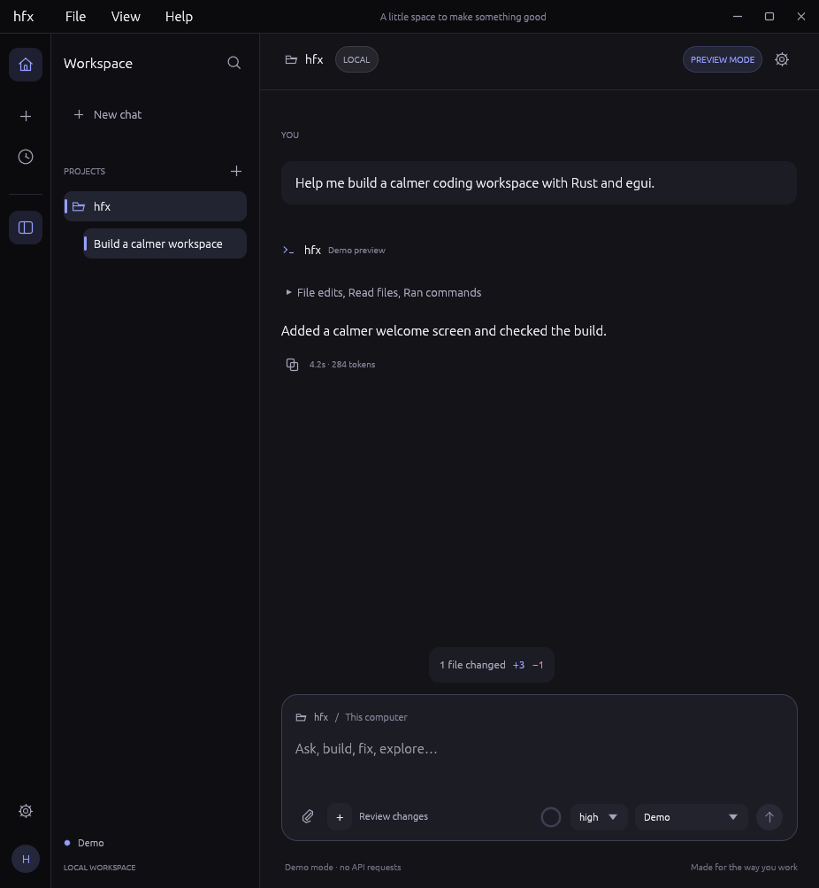
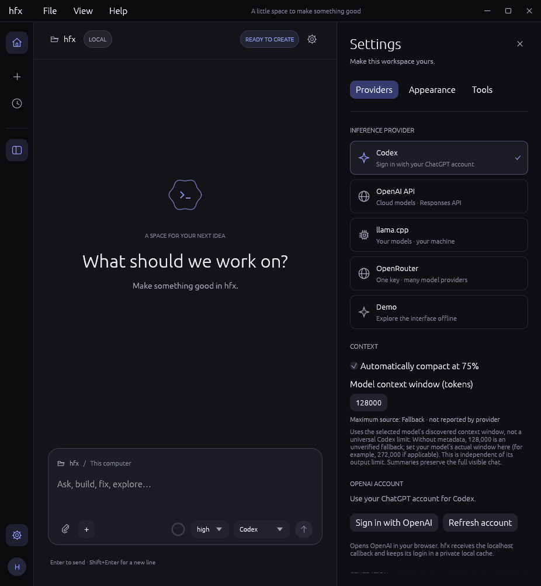

# hfx

A native coding harness built with **Rust + egui**. Work with **Codex, OpenAI API, OpenRouter, or llama.cpp** in one focused desktop workspace—with streaming replies, reasoning displays, file edits, shell commands, and web research.

[Quick start](#quick-start) · [Screenshots](#screenshots) · [Provider setup](docs/providers.md) · [Documentation](#documentation)



## What it does

- **One interface, four providers.** Sign in with your ChatGPT account, use an API key, or connect a local llama.cpp server. Demo mode works without credentials.
- **Project-aware conversations.** Keep separate chats and drafts for each project; attach code, files, and images by picker, paste, or drag-and-drop.
- **Workspace tools.** Read and edit files, run commands, search the web, and return images. Expand the action history to inspect results, timings, and recorded edit diffs.
- **Queue and steer.** Queue follow-ups while a reply runs, or guide the active run at the next safe model/tool boundary.
- **Long-running context.** Automatic compaction summarizes older context at 75% of the configured model window without deleting the visible conversation.
- **A quiet native UI.** Animated text reveal, reduced-motion controls, local chat persistence, and optional Linux completion notifications and sound.

## Quick start

### Run from source

Install **Rust 1.95 or later**, then run from this checkout:

```bash
cargo run --release --locked
```

The app starts in **Demo** mode. Send a message to try the streaming interface without a model or credentials. The current working directory becomes the first project for a fresh profile.

On Linux, you need a desktop session and compatible Wayland/X11 and OpenGL runtime libraries. Build dependencies may include a C compiler, `pkg-config`, and development packages for X11, Wayland, and xkbcommon. See the [Linux guide](docs/linux.md) for installation details.

### Install on Linux

```bash
./scripts/install-linux.sh --desktop-shortcut
```

This builds and installs hfx **for your user only**, without `sudo`: the executable goes to `~/.local/bin/hfx` by default, with an application-menu entry, icons, and an optional Desktop shortcut. Omit `--desktop-shortcut` for just the menu/dock entry.

Rerun the installer to update, then restart hfx. To uninstall while preserving chats, settings, and credentials:

```bash
./scripts/uninstall-linux.sh
```

See [Linux installation and desktop integration](docs/linux.md) for custom paths, launcher behavior, portable bundles, and completion alerts.

## Connect a model

Open **Settings → Providers** with the gear icon or **Ctrl/Cmd+,**.

| Provider | Get started |
| --- | --- |
| **Codex** | Choose **Sign in with OpenAI**, complete browser sign-in, then select a discovered model. No Codex CLI is required. |
| **OpenAI API** | Enter an API key or set `OPENAI_API_KEY`; choose a Responses-compatible model available to your account. |
| **OpenRouter** | Enter an API key or set `OPENROUTER_API_KEY`; use a `provider/model` ID. |
| **llama.cpp** | Start `llama-server`, connect to `http://127.0.0.1:8080/v1`, and match the model ID to the server alias. |

Use **Test connection** to discover models for API/server connections. Reasoning, tools, and image support vary by model and endpoint. API billing and access are separate from ChatGPT subscription access.

The [provider setup guide](docs/providers.md) covers authentication, endpoints, streaming behavior, and a llama.cpp launch example.

## Command access and privacy

> **Commands run on your host by default.** They execute as your normal user, inherit your Git/SSH setup and environment, and can access credentials or change files outside the project. Trusted mode is **not** a filesystem or secret-isolation boundary. Use it only with code you trust.

In **Settings → Tools**, enable **Review each tool action** for approvals or choose **Strict workspace sandbox** for command confinement on Linux. Strict mode requires **bubblewrap 0.12 or later**, user namespaces, and overlay filesystem support; missing support produces an error rather than falling back to trusted access. File and image tools always enforce workspace-relative paths.

Chats and file context are saved locally in **plaintext**. API keys entered in settings stay in memory and are not serialized; Codex OAuth credentials are stored in a separate private-permission plaintext cache. See [Tools & security](docs/tools.md) and [Motion and persistence](docs/usage.md#motion-and-persistence) before working with sensitive data.

## Screenshots

These are native captures of **scripted previews**, not live model sessions. They contain no private chat history or login credentials. Click an image to view it at full size.

| Tool activity and recorded file changes | Provider settings and Codex sign-in |
| --- | --- |
| [](assets/screenshots/actions.png) | [](assets/screenshots/codex.png) |

The welcome screen is shown above. To reproduce all three images, see [Refresh README screenshots](docs/development.md#refresh-readme-screenshots).

## Shortcuts

Use **Ctrl** on Linux/Windows and **Cmd** on macOS.

| Shortcut | Action |
| --- | --- |
| Enter | Send, or queue a follow-up while running |
| Shift+Enter | Insert a newline |
| Ctrl/Cmd+Enter | Steer the active run in this chat |
| Ctrl/Cmd+N | New chat |
| Ctrl/Cmd+, | Settings |
| Ctrl/Cmd+B | Toggle sidebar |
| Ctrl/Cmd+K | Search chats |
| Escape | Close the image viewer; otherwise decline a pending tool, close a panel, or stop generation |

## Documentation

| Guide | Topics |
| --- | --- |
| [Provider setup](docs/providers.md) | Codex sign-in, API keys, compatible endpoints, llama.cpp, and provider capabilities |
| [Using hfx](docs/usage.md) | Projects, attachments, queueing, steering, context compaction, persistence, and clean shutdown |
| [Tools & security](docs/tools.md) | Tool reference, review mode, trusted commands, strict sandboxing, Git authentication/attribution, and web research |
| [Linux integration](docs/linux.md) | Per-user installation, desktop launchers, portable bundles, completion alerts, and background rendering |
| [Development & visual QA](docs/development.md) | Checks, scripted previews, screenshot regeneration, source map, and protocol references |

## Development

```bash
cargo fmt --all --check
cargo test --locked
cargo clippy --locked --all-targets -- -D warnings
```

To explore a scripted preview without replacing saved chats:

```bash
cargo run --locked -- --preview=chat
```

See the [development guide](docs/development.md) for other previews, headless visual QA, and Linux installer tests.

## License

[MIT](LICENSE).
